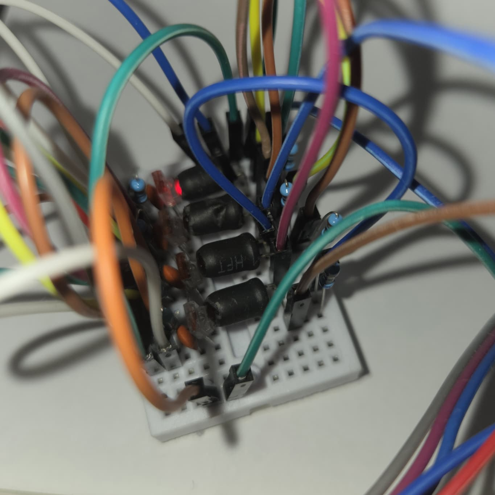
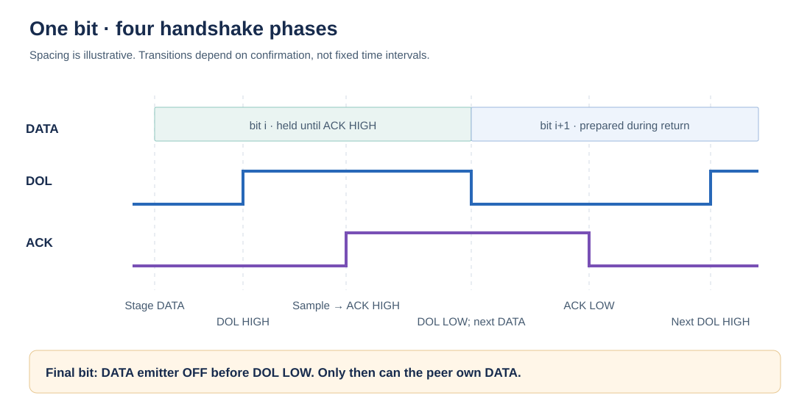
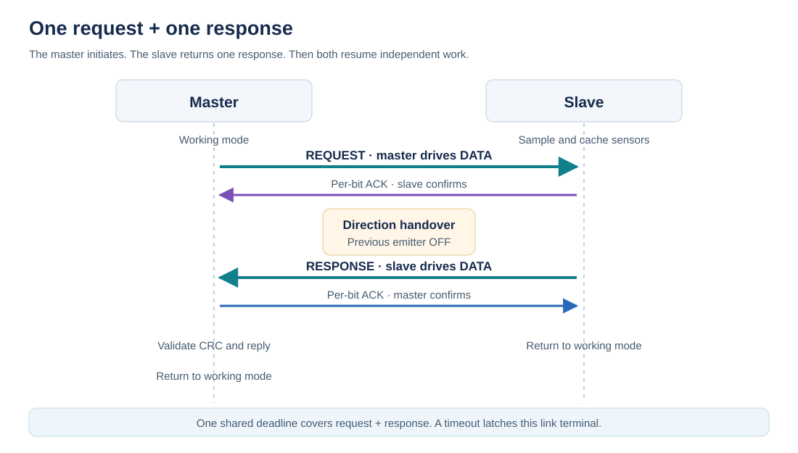

# MFI — MihiOr Fast Interface

MFI connects two electronic units through three optical fibers. One fiber carries data in either direction; the other two carry data-ready and read-confirmation signals. Every bit advances through a handshake. There is no clock wire, configured baud rate, or fixed delay between bits.

The master starts a request, the slave sends one response, and both return to their own work. Master and slave are roles of a connection: a unit can be master on one MFI link and slave on another.


## Prototype



The prototype uses four direct LED-to-receiver paths. Two simplex data paths stand in for the shared half-duplex data fiber, with software enforcing direction ownership. See [prototype.md](docs/prototype.md) for the circuit schematics and component values.

## How a bit moves

1. The sender puts a bit on DATA, then raises its signal to mean **data on line** (DOL).
2. The receiver sees DOL HIGH, samples DATA, and raises its own signal to mean **read confirmed** (ACK).
3. The sender sees ACK HIGH, lowers DOL, and prepares the next data bit.
4. The receiver sees DOL LOW and lowers ACK. The sender sees ACK LOW and raises DOL for the next bit.

For the final bit, the sender turns its data emitter off **before** lowering DOL. The receiver can then finish ACK and become the sender for the response. The two endpoints never drive the shared data fiber at the same time.



HIGH means a valid optical signal; LOW means no signal. The electrical interfaces at the transceivers must present that polarity to the GPIO adapter. Fiber numbering is local to each endpoint: its fiber 1 receives the peer's signal, fiber 2 carries data, and fiber 3 sends its own signal.

## Request and response



While idle, the slave samples sensors and caches values. An incoming DOL HIGH starts service, either through a GPIO interrupt or a level check. Once a conversation begins, the communication path owns the link until the request and response finish. Sensor polling, logging, and unrelated application work happen outside that conversation.

The same handshake runs in both directions. During the response, the slave generates DOL and the master generates ACK. The master does not clock the slave's reply.

The reference example allows two seconds for the entire request/response. A stalled or malformed transfer turns both local transmitters off and latches the connection as terminal. Recovery requires an explicit local reset; packets are never retried automatically.

## Why use it

| Property | What it provides |
| --- | --- |
| Optical medium | Electromagnetic fields do not induce electrical interference in the fiber. Electrical isolation also removes a shared signal-ground requirement between endpoints. |
| Variable bit rate | Each bit takes as long as its data-ready/confirmation cycle needs. Different CPU speeds and service times do not require matching baud settings. |
| Confirmation on every bit | The sender keeps the bit valid until the receiver reports sampling it; it waits for receiver readiness before advancing. |
| One master per connection | Only one endpoint initiates requests. The shared data path has an explicit owner, with no bus arbitration. |
| Typed, compact cells | Commands use six bits. Values use only the width selected by the cell type; no byte alignment is required. |
| Packet CRC and status | CRC detects corrupted packets; slave responses carry OK, warning, or terminal state and optional ASCII information. |

The optical benefit belongs to the physical medium, not to the packet format. Power supplies, GPIO wiring, drivers, and receivers still need suitable EMC design. Conductive cable members or an additional ground connection can also defeat isolation. See [Corning's fiber overview](https://www.corning.com/optical-communications/worldwide/en/home/products/fiber/optical-fiber-advantage.html).

Compared with UART, MFI has no agreed sampling baud rate and confirms each bit. Compared with SPI, it has no separate clock and a slave response runs under the slave's own DOL/ACK handshake. I²C already supports clock stretching; MFI instead uses separate optical confirmation paths and a point-to-point request/response model. These differences are useful when clock matching, isolation, or receiver pacing matter. They do not imply higher throughput: four handshake phases and round-trip propagation cost time, and hardware UART/SPI controllers generally use less CPU. [SPI reference](https://www.microchip.com/en-us/products/microcontrollers/8-bit-mcus/peripherals/communication-connectivity/spi), [I²C specification](https://www.nxp.com/docs/en/user-guide/UM10204.pdf).

## Packet format

Bits are sent most significant first. `CELL_COUNT` counts payload cells, not bytes.

```text
Master: 1011 | CELL_COUNT[6] | CELLS... | CRC[32]
Slave:  1011 | STATE[3] | INFO_LENGTH[7] | ASCII[8 × length]
             | CELL_COUNT[6] | CELLS... | CRC[32]
```

There can be 0–63 cells. Slave information holds 0–127 ASCII characters. The CRC covers every preceding transmitted bit, including the pre-header. It has polynomial `0x04C11DB7`, initial value `0xFFFFFFFF`, no reflection, no final XOR, and no byte-padding input.

The full type tables, handshake rules, CRC vectors, and fault behavior are in [the protocol specification](docs/protocol.md). GPIO requirements and optical integration are in [the hardware guide](docs/hardware.md). The [prototype hardware notes](docs/prototype.md) include a photograph and the receiver/LED circuits.

## Code example

Command meanings belong to the application. This example assigns command `1` to reading a cached digital input:

```cpp
#include <mfi/codec.hpp>

mfi::Packet request;
request.count = 1;
request.cells[0] = {1, 1, 0}; // TYPE 001: command 1, no value

mfi::Bits bits;
if (!mfi::encode(request, mfi::Role::Master, bits)) {
    // Invalid packet; do not transmit.
}

// A slave reply can contain the value and its age in 100 ns ticks.
mfi::Packet reply;
reply.count = 2;
reply.cells[0] = {1, 0, 1};     // TYPE 001: one-bit value
reply.cells[1] = {6, 0, 1204};  // TYPE 110: 120.4 microseconds
```

The runnable [codec example](examples/codec.cpp) encodes and decodes both frames. The [STM32 integration example](examples/stm32f1.cpp) shows master exchange, slave service, cached sampling, and interrupt masking around a whole conversation.

## Build and test

A C++14 compiler and CMake 3.20 or later are sufficient for the portable library:

```sh
cmake -S . -B build/host -DCMAKE_BUILD_TYPE=Release
cmake --build build/host
ctest --test-dir build/host --output-on-failure
```

Run `build/host/mfi_example` (`mfi_example.exe` on Windows). To embed the library:

```cmake
add_subdirectory(path/to/mfi)
target_link_libraries(your_application PRIVATE mfi::mfi)
```

[Porting and API documentation](docs/porting.md) describes the portable GPIO adapter and the optional Cortex-M3 assembly backend. Host tests cover packet types, sizes, CRC corruption, streaming decode, handshake ordering, direction reversal, roles, and terminal latches. ARM tests execute the extracted Thumb-2 code against an emulated GPIO peer; they verify behavior, not physical timing. No maximum bit rate or safety certification is claimed.

## Repository layout

```text
include/mfi/       Portable codec, handshake transport, connection ownership
src/               Portable packet implementation
ports/stm32f1/     Configurable GPIO adapter and Thumb-2 transport
examples/          Host packet example and embedded integration example
tests/             Host tests and assembly behavior tests
docs/              Protocol, hardware, porting, and SVG diagrams
```

## License

Copyright © 2026 MihiOr. All rights reserved. See [LICENSE](LICENSE).
