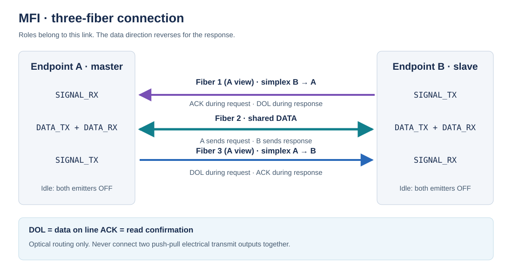

# Optical connection



Each endpoint presents four electrical signals to the optical interface:

| Signal | Direction at the MCU | Function |
| --- | --- | --- |
| DATA_TX | Output | Emits the current data bit; LOW must turn the emitter off |
| DATA_RX | Input | Reads the shared data fiber |
| SIGNAL_TX | Output | DOL while sending, ACK while receiving |
| SIGNAL_RX | Input | ACK while sending, DOL while receiving |

Wire the optical paths as follows:

```text
A.SIGNAL_TX ───────────────► B.SIGNAL_RX  (simplex)
A.DATA_TX/RX ◄─────────────► B.DATA_TX/RX (one half-duplex fiber)
A.SIGNAL_RX ◄─────────────── B.SIGNAL_TX  (simplex)
```

The diagram describes optical routing. It does **not** instruct connecting two push-pull electrical outputs together. The shared data fiber needs optical frontends that allow transmission and reception at either end, with only one emitter active at a time. The protocol does not specify a particular wavelength, connector, emitter, detector, or optical coupling arrangement.

Local fiber 1 is SIGNAL_RX, fiber 2 is DATA, and fiber 3 is SIGNAL_TX. Consequently A's fiber 3 meets B's fiber 1, and B's fiber 3 meets A's fiber 1. Electrical DATA_TX and DATA_RX remain separate pins even though they serve the same optical fiber.

The [prototype notes](prototype.md) document the built receiver and LED circuits separately from the three-fiber link model.

## Polarity and idle

Use non-inverting logical signals at the adapter boundary: light present is HIGH; no light is LOW. Translate or invert the receiver output in hardware if needed. Both local transmit outputs are LOW while idle or disconnected. Receiving endpoints do not read DATA until DOL is HIGH.

The transceiver interface must meet MCU voltage limits. Bias receiver inputs so unplugged optics do not float HIGH. A signal stuck HIGH or LOW during a conversation reaches the exchange deadline and disconnects the link. A broken link while completely idle is not detected until the master requests something; heartbeat requests are an application policy.

## Timing and routing

DATA must arrive and settle at the receiver before DOL is sampled HIGH, and remain valid until ACK HIGH reaches the sender. Account for GPIO writes, emitter/detector delay, filtering, fiber propagation, and path skew. The protocol has no inserted timing delays, but hardware still has setup and hold constraints. DOL/ACK confirmation does not fix a data path that arrives later than its DOL path.

Each bit crosses the link in four control phases, so long propagation paths lower the effective bit rate. Choose optics with adequate bandwidth and a clean digital threshold; verify all three paths at the intended distance and environment. There is no universal throughput or distance figure for MFI.

The final-bit ordering is required on both endpoints:

```text
observe ACK HIGH → DATA_TX LOW → DOL LOW → observe ACK LOW
```

The receiver then owns the data path for its reply. Its ACK LOW can be very short before the response's DOL HIGH. Preserve that falling edge with a hardware latch or a validated equivalent. The STM32F1 adapter maps SIGNAL_RX to EXTI and uses its pending flag while the interrupt is masked.

## Isolation and electromagnetic interference

An all-dielectric fiber carries light and provides no conductive signal path between the units. It is immune to induced electrical interference on the transmission medium and avoids ground loops through signal conductors. This is an advantage of fiber; UART, SPI, or other formats can also use suitable optical interfaces.

The electronics and their power sources remain susceptible to their local environment. Isolation depends on the complete installation, including power, shields, cable construction, and any additional connections. MFI defines neither an isolation voltage rating nor an EMC qualification. [Corning: optical fiber advantages](https://www.corning.com/optical-communications/worldwide/en/home/products/fiber/optical-fiber-advantage.html).

## Several links on one unit

Give each link its own optical paths, GPIOs, state, role, and handler. One unit may initiate requests on one connection and answer requests on another. A software transport that occupies the CPU for a full exchange cannot simultaneously service another link on that core; scheduling or dedicated hardware must account for this.

The portable transport accepts separate port instances. The supplied assembly backend has one compile-time GPIO mapping and owns that single mapping; do not construct multiple active links over the same pins. It can serve either role. The protocol itself does not limit an electronic unit to one MFI connection.
