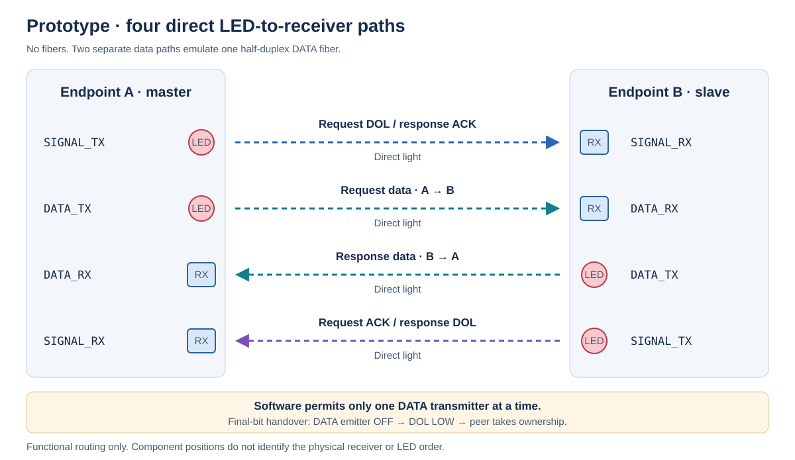
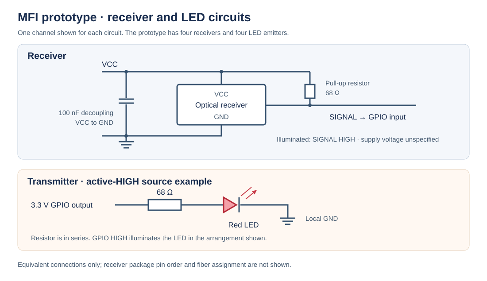

# Optical prototype

The prototype was built with two STM32 Blue Pill boards: one master and one slave.

The prototype uses four direct LED-to-receiver optical paths. There are no fibers: the red LEDs shine directly into devices described as laser receivers. Each receiver has 100 nF supply-decoupling capacitance between VCC and GND and a 68 Ω pull-up resistor between VCC and SIGNAL. Each standard red LED has a 68 Ω series resistor. The transmitters operate from 3.3 V GPIO outputs. A receiver's SIGNAL is logical HIGH when illuminated.

## Four-path prototype connection

| Direct optical path | Function |
| --- | --- |
| A.SIGNAL_TX → B.SIGNAL_RX | Request DOL / response ACK |
| A.DATA_TX → B.DATA_RX | Request data |
| B.DATA_TX → A.DATA_RX | Response data |
| B.SIGNAL_TX → A.SIGNAL_RX | Request ACK / response DOL |

The two data paths are physically separate simplex paths. They stand in for the protocol's single half-duplex data fiber. Software still permits only one data transmitter at a time: the sender turns DATA_TX off before releasing the final DOL, then the peer takes ownership for its response. This preserves the direction handover required by the intended three-fiber implementation.

The prototype exercises the handshake, framing, parsing and software direction ownership. It does not test shared-fiber optical coupling, fiber propagation or routing. The four paths represent the complete logical connection; the photograph groups the receiver components physically on a breadboard.

## Receiver and transmitter circuits

The receiver drawing shows electrical connections by function, not device package pin order. The model and supply voltage are unidentified. The transmit circuit shows active-HIGH GPIO drive: HIGH lights the LED, and LOW turns it off. Because the receiver reports HIGH when illuminated, the signal polarity matches the MFI adapter without an inversion stage.

| Component or connection | Prototype detail |
| --- | --- |
| Receivers | Four optical receiver devices; part number unknown |
| Receiver supply | VCC and GND; voltage not specified |
| Supply decoupling | 100 nF between VCC and GND at each receiver |
| Receiver signal resistor | 68 Ω pull-up between VCC and SIGNAL |
| Receiver polarity | Logical HIGH when illuminated |
| Emitters | Four standard red LEDs |
| LED resistor | 68 Ω in series with each LED |
| GPIO output level | 3.3 V |

The same 68 Ω value is used for two different components: the receiver's pull-up and the LED's series resistor. The schematic records the prototype values; the receiver's internal output circuit and electrical ratings are not identified.

The wire protocol remains the DOL/ACK handshake in [protocol.md](protocol.md). The intended three-fiber optical arrangement is documented separately in [hardware.md](hardware.md).
